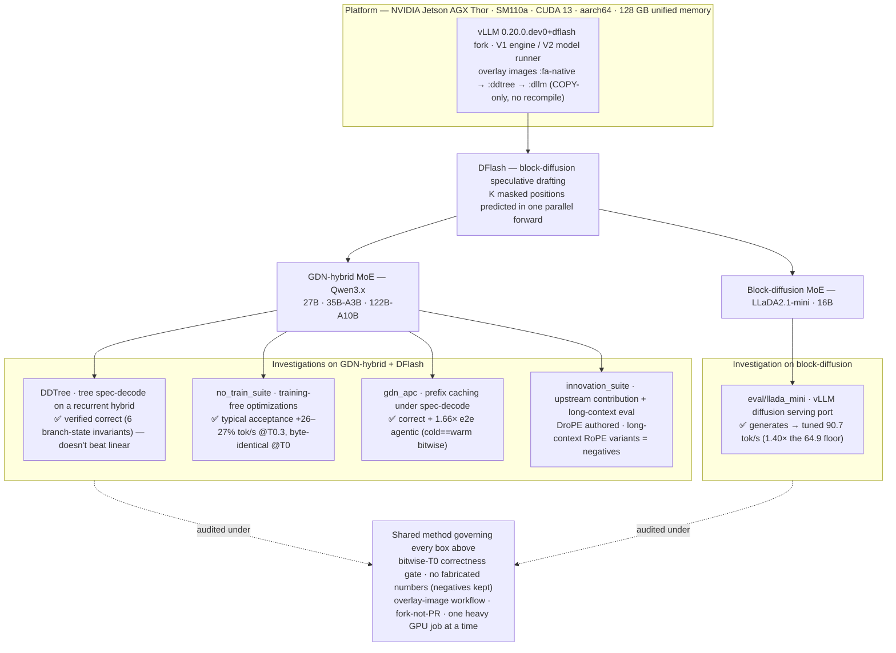

# dflash-caddtree-integrations

A research **monorepo** of LLM-inference experiments on **NVIDIA Jetson AGX Thor**
(SM110a / CUDA 13 / aarch64, 128 GB unified memory). Every investigation here asks
one version of the same question:

> **How much decode speed can we get out of a big MoE model on a single Thor —
> losslessly where possible, honestly measured — using speculative decoding,
> quantization, caching, and architecture-aware kernels?**

The through-line is **DFlash** (block-diffusion speculative drafting, arXiv:2602.06036)
running in a **vLLM `0.20.0.dev0+dflash` fork**, applied to two model families:

- **GDN-hybrid MoE** — the `Qwen3.x` family (Gated-Delta-Net recurrent + attention
  hybrid; 27B, 35B-A3B, 122B-A10B), and
- **Block-diffusion MoE** — `LLaDA2.1-mini` (a 16B diffusion LM).

Several experiments produced **clean negative or "already-solved" results**. Those are
kept and documented as first-class outcomes — the repo is a faithful characterization
of what does and does not move the needle on this hardware, not a highlight reel.

---

## Architecture at a glance

One shared stack (Thor → vLLM dflash fork → DFlash drafting) feeds two model families,
each with its own line of investigation. Every box is held to the same correctness method.



---

## What's in here (map of investigations)

| Area | Question | Honest result | Entry doc |
|------|----------|---------------|-----------|
| **DDTree** (root: `src/`, `patches/`, `benchmark_results/`, `image-src/`) | Can tree speculative decoding work on a **recurrent GDN-hybrid** (which the DDTree/CaDDTree papers deferred as future work)? | ✅ **First working + verified-correct** tree spec-decode on GDN-hybrid (6 branch-state invariants, W=1 byte-identical). Optimized 3.6×, but **does not beat strong-draft linear DFlash** at feasible budgets (depth beats breadth). The real win moved to the linear path (typical acceptance). | [`docs/DDTREE.md`](docs/DDTREE.md) |
| **`no_train_suite/`** | Which **training-free** inference optimizations actually help DFlash + GDN-hybrid? | ✅ **Typical (Medusa-style) acceptance = +26–27% tok/s @ T=0.3** on 27B/122B, **byte-identical at T=0**. Most other stages proved **moot / already-fused / device-moot** on Thor's unified memory — a deliberate negative-heavy audit. | [`no_train_suite/SUITE_SUMMARY.md`](no_train_suite/SUITE_SUMMARY.md) |
| **`gdn_apc/`** | Can **automatic prefix caching** coexist with DFlash spec-decode on a recurrent hybrid? | ✅ **Correct + 1.66× e2e** on a 11.8k-tok / 4-turn agentic trace (cold==warm **bitwise**). Bitwise *base*-parity is **not achievable** — a property of all spec decode, **not** an APC corruption. | [`gdn_apc/GDN_APC_SUMMARY.md`](gdn_apc/GDN_APC_SUMMARY.md) |
| **`innovation_suite/`** | Autonomous **upstream-contribution + long-context eval** run | Key finding: **most planned bugfixes already landed upstream** (no redundant PRs). One novel branch authored (**DroPE** rope_type). Long-context (LongRoPE / YaRN / DroPE / LongPPL) = **negatives**: inference-time tricks don't beat std-RoPE on GDN-hybrid. | [`innovation_suite/INNOVATION_SUITE_SUMMARY.md`](innovation_suite/INNOVATION_SUITE_SUMMARY.md) |
| **`innovation_suite/eval/llada_mini/`** | Fastest inference stack for **LLaDA2.1-mini block-diffusion** on Thor | ✅ **vLLM block-diffusion GENERATES on our fork → tuned 90.7 tok/s** (1.40× the 64.9 raw-transformers floor) via a gated 14-file pure-Python port + flashinfer non-causal + denoise-threshold speed mode. NVFP4 loads (CUTLASS FP4) but is a memory win only at concurrency-1; SGLang blocked on aarch64 ABI. | [`innovation_suite/eval/llada_mini/`](innovation_suite/eval/llada_mini/) |

Each area has its own summary/results docs; this README is the index and the shared
context. Detailed per-file change maps live in each area (e.g. `CHANGES.md` for DDTree).

---

## The shared method (why the results are trustworthy)

Every experiment in this repo follows the same discipline:

1. **Bitwise correctness is sacred.** Lossless changes must be **byte-identical at
   T=0** (real token-ID diff, not eyeballing). Nothing that diverges at greedy ships.
   Lossy wins (e.g. typical acceptance) are **opt-in and T>0 only**, with a T=0 guard.
2. **No fabricated numbers.** Gates that couldn't be run are marked NOT-EXECUTED;
   a clean negative result is reported as-is. Several headline outcomes here *are*
   negatives.
3. **Overlay-image workflow.** Work is authored against **byte-identical copies of a
   frozen base image's own files** and shipped as a **COPY-only overlay** image
   (`Dockerfile.ddtree` etc.) — no recompile, fast, reproducible. `src_original/`
   holds pre-change originals so `patches/*.diff` are self-contained.
4. **Fork, don't PR.** Genuine upstream changes are GPG-signed and pushed to a
   **personal fork for human review** — never opened against `vllm-project` directly
   (per vLLM's `AGENTS.md`; pure code-agent PRs are disallowed).
5. **One heavy job at a time.** Thor's 128 GB is *unified* memory — a GPU serve
   reserving a mem-fraction plus a concurrent compile can OOM the box. Launchers
   enforce serialization + cgroup `--memory` caps + graceful stop (learned the hard way).

---

## Platform

- **Hardware:** NVIDIA Jetson AGX Thor, **SM110a** (Blackwell-class), CUDA 13, aarch64,
  128 GB unified LPDDR.
- **Runtime:** vLLM **`0.20.0.dev0+dflash`** fork (image tags `:fa-native`, `:ddtree`,
  `:dllm`). V1 engine / V2 model runner.
- **Draft method:** **DFlash** — parallel block-diffusion drafting (K masked positions
  in one forward).
- **Models:** Qwen3.x GDN-hybrid MoE (27B / 35B-A3B / 122B-A10B, NVFP4/compressed-tensors);
  LLaDA2.1-mini block-diffusion MoE (BF16 + NVFP4).

---

## Repository layout

```
README.md                      ← this file (monorepo index)
docs/
  DDTREE.md                    ← DDTree subproject writeup (the former root README)
  IMPLEMENTATION_PLAN.md       ← DDTree invariant→file contract
CHANGES.md                     ← DDTree per-file change map + flat-pos convention
IMPLEMENTATION_NOTES.md        ← DDTree design notes / proofs
Dockerfile.ddtree             ← DDTree overlay build (COPY-only, no recompile)
src/ , src_original/ , patches/, image-src/   ← DDTree code, originals, diffs
benchmark_results/            ← DDTree + staged-optimization + LongRoPE/LongPPL results
tests/                        ← DDTree invariant + synthetic suites

no_train_suite/               ← training-free DFlash optimizations (typical acceptance, audits)
  SUITE_SUMMARY.md, designs/, benchmarks/, correctness/, profiles/

gdn_apc/                      ← GDN prefix caching under DFlash spec-decode
  GDN_APC_SUMMARY.md, benchmarks/, correctness/, designs/

innovation_suite/            ← autonomous upstream-contribution + long-context eval
  INNOVATION_SUITE_SUMMARY.md, SUITE_NOTES.md, designs/ (RFCs), pr_drafts/, tools/
  eval/
    llada_mini/              ← LLaDA2.1-mini block-diffusion serving + optimization sweep
    longrope_research.md, RULER_GATING.md, attestation/
```

---

## Where to start

- **Want the headline speedups?** → `no_train_suite/SUITE_SUMMARY.md` (typical
  acceptance) and `innovation_suite/eval/llada_mini/vllm_optimization_results.md`
  (block-diffusion, 90.7 tok/s).
- **Want the deep architecture work?** → [`docs/DDTREE.md`](docs/DDTREE.md) (tree
  spec-decode on a recurrent hybrid, the six GDN branch-state invariants).
- **Want the honest negatives?** → `innovation_suite/` (long-context RoPE variants) and
  the "moot/deferred" tables in `no_train_suite/SUITE_SUMMARY.md`.

## References
- DFlash — arXiv:2602.06036 · DDTree — arXiv:2604.12989 · CaDDTree — arXiv:2606.01813
